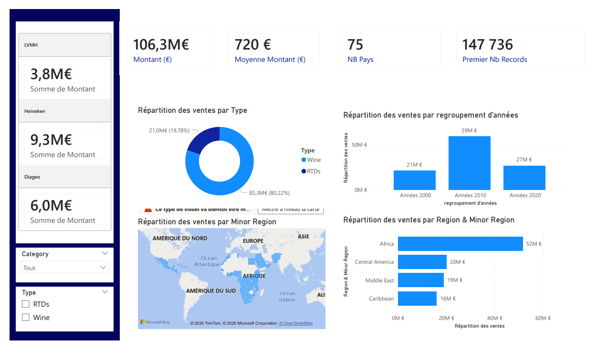
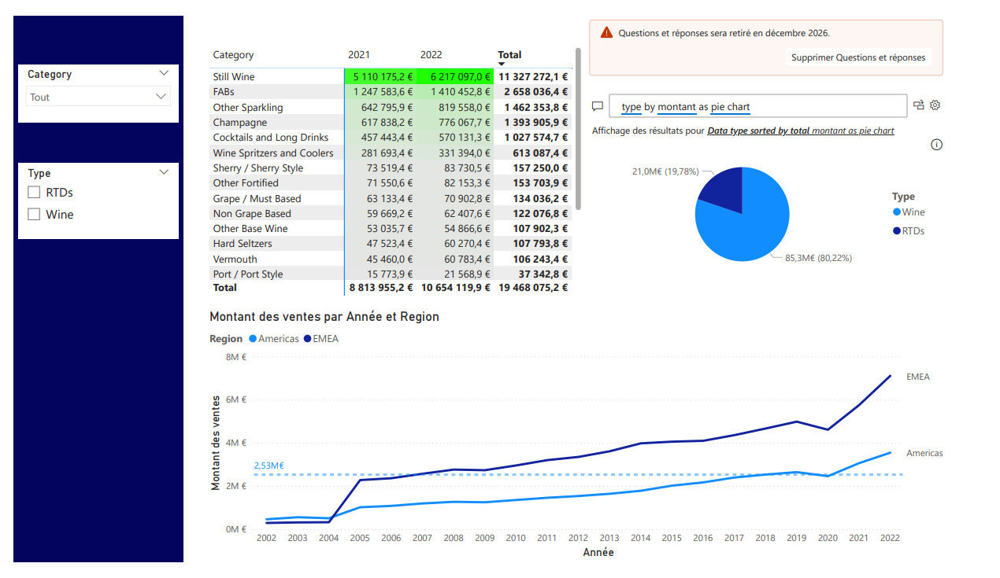

# Global Sales Analytics Dashboard (Power BI)

## Project Overview

This project presents an interactive **Sales Analytics Dashboard** built using Power BI.
It provides insights into global sales performance across regions, product categories, and time.

The goal is to demonstrate **Business Intelligence and Data Visualization skills** by transforming raw data into actionable insights.

---

## Key Features

* Total Revenue: 106.3M€
*  Sales distribution by region (EMEA, Americas, etc.)
*  Category-level analysis (Champagne, Wines, Spirits, etc.)
*  Time-based trends (2002–2022)
*  Geographic sales visualization (map)
*  KPIs: Average sales, number of countries, transactions

---

## Tools & Technologies

* Power BI
* Data Visualization
* Data Cleaning & Transformation
* DAX

---

## Dashboard Preview
Page 1 – Sales Overview

This page displays global KPIs such as total revenue and average sales, along with an overview of sales distribution.

---
Page 2 – Detailed Analysis

## Insights

* EMEA region generates the highest revenue (~51.6M€)
* Wine dominates sales (~80%+ share)
* Significant growth observed after 2015
* Premium categories contribute disproportionately to revenue

---
## Live Dashboard

[Dashboard Power BI :](https://app.powerbi.com/links/gB6AqWGf1M?ctid=b8c19512-2aed-471d-a8d1-9b06e7da786a&pbi_source=linkShare) https://app.powerbi.com/links/gB6AqWGf1M?ctid=b8c19512-2aed-471d-a8d1-9b06e7da786a&pbi_source=linkShare

---
